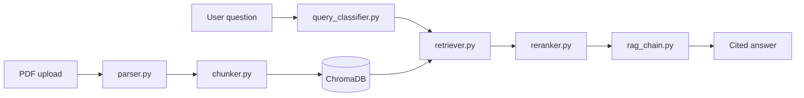

# Engineering RAG for OEM Manuals

Retrieval-augmented generation system for **OEM parts catalogues** and **maintenance manuals**. Engineers ask questions in plain language and get cited answers with part numbers, torque specs, and procedures — without manually searching hundreds of PDF pages.

Built for Caterpillar-style technical manuals (SEBP parts catalogues + service manuals). Evaluated with **RAGAS** at **0.84 overall** (K=6, advanced pipeline).

**Author:** [Kwame Essuman](https://github.com/kaybee77) · [Portfolio](https://technest-week-2.vercel.app) · [Engineering write-up](docs/WRITEUP.md)

---

## Features

- **Table-aware PDF parsing** — PyMuPDF + pdfplumber for headings, narrative text, and tables
- **Hierarchical chunking** — parent (~850 chars) + child (~220 chars) with parent resolution at answer time
- **Dual-corpus routing** — rule-based query classifier sends parts vs maintenance queries to the right ChromaDB collection
- **Hybrid retrieval** — BM25 + vector search for parts; vector search for maintenance
- **Cross-encoder reranking** — MiniLM reranker for higher precision
- **Query rewriting** — optional LLM rewrite before retrieval
- **Streamlit UI** — chat interface with citations and feedback capture
- **RAGAS evaluation** — faithfulness, relevancy, context precision/recall with HTML reports

## Stack

| Layer | Technology |
| --- | --- |
| API | FastAPI, Uvicorn |
| Frontend | Streamlit |
| Vector DB | ChromaDB |
| Embeddings | BAAI/bge-base-en-v1.5 |
| Reranker | cross-encoder/ms-marco-MiniLM-L-6-v2 |
| LLM | GPT-4.1-mini |
| Retrieval | rank-bm25 + LangChain |
| Infra | Docker Compose |

## Architecture



**Ingestion:** `upload → parse → chunk → index`

**Query (production `/ask/advanced`):** classify → retrieve (hybrid) → rerank → parent resolution → generate

## Quick start

### Prerequisites

- Docker & Docker Compose
- OpenAI API key

### Run with Docker

```bash
git clone https://github.com/kayess007/engineering_Rag.git
cd engineering_Rag
cp .env.example .env
# Edit .env — set OPENAI_API_KEY and strong RAG_JWT_SECRET

docker compose up --build
```

| Service | URL |
| --- | --- |
| FastAPI | http://localhost:8000 |
| Streamlit UI | http://localhost:8501 |
| Health | http://localhost:8000/health |

### Local development (without Docker)

```bash
python -m venv .venv
source .venv/bin/activate   # Windows: .venv\Scripts\activate
pip install -r requirements.txt
cp .env.example .env

# Terminal 1 — API
uvicorn app.main:app --reload --port 8000

# Terminal 2 — UI
streamlit run frontend/app.py
```

## API overview

| Method | Endpoint | Description |
| --- | --- | --- |
| `POST` | `/auth/token` | JWT login |
| `POST` | `/manuals/upload` | Upload PDF |
| `POST` | `/manuals/chunk` | Chunk parsed document |
| `POST` | `/manuals/index` | Index chunks in ChromaDB |
| `GET` | `/manuals/list` | List indexed manuals |
| `POST` | `/ask/advanced` | Full RAG pipeline (recommended) |
| `POST` | `/query` | Retrieval only |
| `POST` | `/feedback` | Capture user feedback |

Most routes require a Bearer token from `/auth/token`.

## Evaluation

```bash
# From project root with OPENAI_API_KEY set
python evaluation/run_ragas.py
python evaluation/chunk_similarity.py   # corpus separation analysis
python evaluation/generate_report.py    # HTML report from latest run
```

Latest benchmark (15-question set, K=6, advanced mode):

| Metric | Score |
| --- | --- |
| Faithfulness | 0.97 |
| Answer relevancy | 0.91 |
| Context precision | 0.65 |
| Context recall | 0.77 |
| **Overall** | **0.84** |

See [docs/WRITEUP.md](docs/WRITEUP.md) for architecture decisions, failure modes, and what moved scores from 0.78 → 0.84.

## Project layout

```
app/           FastAPI backend — parser, chunker, retriever, RAG chain
frontend/      Streamlit chat UI
evaluation/    RAGAS scripts and reports
storage/       Uploads, parsed JSON, chunks, Chroma (gitignored)
docs/          Engineering write-up
```

## Security notes

- Change default `RAG_USERNAME`, `RAG_PASSWORD`, and `RAG_JWT_SECRET` before any public deployment.
- Do not commit `.env` or uploaded OEM PDFs.
- `.env` is gitignored; use `.env.example` as a template.

## License

MIT — see [LICENSE](LICENSE) if present, or contact the author for usage terms on OEM document corpora.
